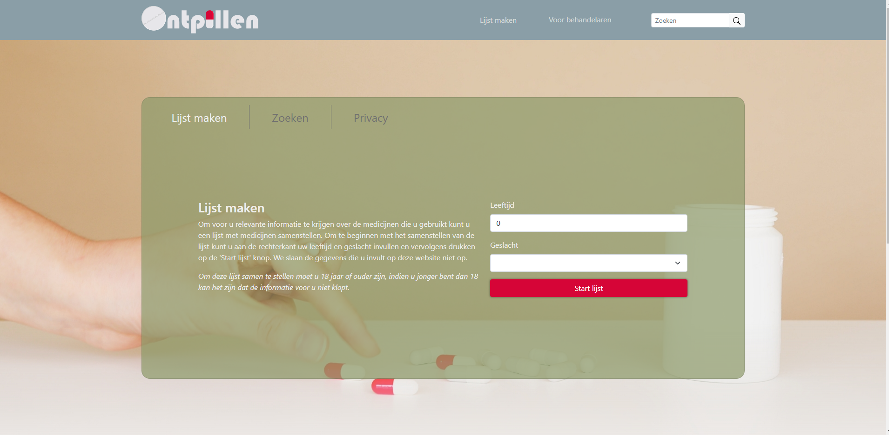

<!-- PROJECT SHIELDS -->
[![Contributors][contributors-shield]][contributors-url]
[![Forks][forks-shield]][forks-url]


<!-- PROJECT LOGO -->
<br />
<p align="center">
  <a href="https://github.com/MinorApplicationDesign/MinorApplicationDesign">
    
  </a>

  <h3 align="center">Ontpillen</h3>

  <p align="center">
    A website that informs drug users with information on how to reduce medicine usage
    <br />
    <a href="https://github.com/MinorApplicationDesign/MinorApplicationDesign"><strong>Explore the docs »</strong></a>
    <br />
    <br />
    <a href="https://github.com/MinorApplicationDesign/MinorApplicationDesign">View Demo</a>
    ·
    <a href="https://github.com/MinorApplicationDesign/MinorApplicationDesign/issues">Report Bug</a>
    ·
    <a href="https://github.com/MinorApplicationDesign/MinorApplicationDesign/issues">Request Feature</a>
  </p>
</p>


<!-- TABLE OF CONTENTS -->
<details open="open">
  <summary><h2 style="display: inline-block">Table of Contents</h2></summary>
  <ol>
    <li>
      <a href="#about-the-project">About The Project</a>
      <ul>
        <li><a href="#built-with">Built With</a></li>
      </ul>
    </li>
    <li><a href="#usage">Usage</a></li>
    <li><a href="#license">License</a></li>
    <li><a href="#contact">Contact</a></li>
    <li><a href="#acknowledgements">Acknowledgements</a></li>
  </ol>
</details>


<!-- ABOUT THE PROJECT -->
## About The Project


There is a lot of information on the internet for different kinds of drugs. However, information 
about the reduction of drugs usage is hard to some by. The goal of our website is to make information about
the reduction of drugs usage easy accessible for users.  
The onpillen website has two pages one page is for the users, here drug users can search for single medicines or
make a list with all the drugs they are using. The website will show general information about the different medicines 
and will show different protocols on how to reduce the usage of them. This information can be saved to a pdf document
which can be used to consult their doctor. 
The other page is for doctors this page is fairly similar to the user one. Here more detailed information about 
the drugs is shown.

DISCLAIMER: The information on this website is no advice! Always consult your psychiatrist.


### Built With

* [Bootstrap](https://getbootstrap.com)
* [JQuery](https://jquery.com)
* [Java](https://java.com)
* [JavaScript](https://www.javascript.com)
* [springboot](https://spring.io/projects/spring-boot)
* [Thymeleaf](https://www.thymeleaf.org/)
* [jsoup](https://jsoup.org/)


<!-- GETTING STARTED 
## Getting Started

To get a local copy up and running follow these simple steps.

### Prerequisites

This is an example of how to list things you need to use the software and how to install them.
* npm
  ```sh
  npm install npm@latest -g
  ```

### Installation

1. Clone the repo
   ```sh
   git clone https://github.com/github_username/repo_name.git
   ```
2. Install NPM packages
   ```sh
   npm install
   ```
  -->


<!-- USAGE EXAMPLES --> 
## Usage

Currently, this project is a work in progress and can't be used. The main usage of the website will
be gathering information about medicines. This information will contain general information and guidelines 
on how to reduce the usage of those medicines. You will be able to save and print this information
and take it to your psychiatrist.


<!-- ROADMAP 
## Roadmap

See the [open issues](https://github.com/github_username/repo_name/issues) for a list of proposed features (and known issues).
-->


<!-- LICENSE 
## License

Distributed under the MIT License. See `LICENSE` for more information.
-->


<!-- CONTACT -->
## Contact

* Larrisa Bouwknegt  - l.bouwknegt@st.hanze.nl
* Naomi Hindriks - n.j.hindriks@st.hanze.nl
* Jonathan Klimp - j.klimp@st.hanze.nl

Project Link: [https://github.com/MinorApplicationDesign/MinorApplicationDesign](https://github.com/MinorApplicationDesign/MinorApplicationDesign)


<!-- ACKNOWLEDGEMENTS -->
## Acknowledgements

* [Img Shields](https://shields.io)
* [Apotheek](https://www.apotheek.nl/)
* [Farmacotherapeutischkompas](https://www.farmacotherapeutischkompas.nl/)
* [ggzstandaarden](https://www.ggzstandaarden.nl/)


<!-- MARKDOWN LINKS & IMAGES -->
<!-- https://www.markdownguide.org/basic-syntax/#reference-style-links -->
[contributors-shield]: https://img.shields.io/github/contributors/MinorApplicationDesign/MinorApplicationDesign.svg?style=for-the-badge
[contributors-url]: https://github.com/MinorApplicationDesign/MinorApplicationDesign/graphs/contributors
[forks-shield]: https://img.shields.io/github/forks/MinorApplicationDesign/MinorApplicationDesign.svg?style=for-the-badge
[forks-url]: https://github.com/MinorApplicationDesign/MinorApplicationDesign/network/members
[stars-shield]: https://img.shields.io/github/stars/MinorApplicationDesign/MinorApplicationDesign.svg?style=for-the-badge
[stars-url]: https://github.com/MinorApplicationDesign/repo/stargazers
[issues-shield]: https://img.shields.io/github/issues/MinorApplicationDesign/MinorApplicationDesign.svg?style=for-the-badge
[issues-url]: https://github.com/MinorApplicationDesign/repo/issues
[license-shield]: https://img.shields.io/github/license/MinorApplicationDesign/MinorApplicationDesign.svg?style=for-the-badge
[license-url]: https://github.com/MinorApplicationDesign/repo/blob/master/LICENSE.txt